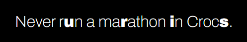
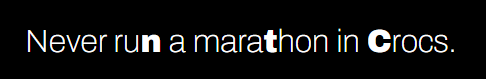

# Just a study project.

#### Inspired by [this Paula Scher's job](https://www.designweek.co.uk/issues/30-march-5-april-2015/paula-scher-uses-revolutionary-typeface-in-rebrand-of-the-new-school/).

## You can test it on [this link](https://random-bold.vercel.app/).

---

#### **Stack**:

- HTML
- CSS
- JS

---

#### **Features**:

- Gets random advices from [here](https://api.adviceslip.com/advice)
- Randomizes the text to insert random bold characters within the text

